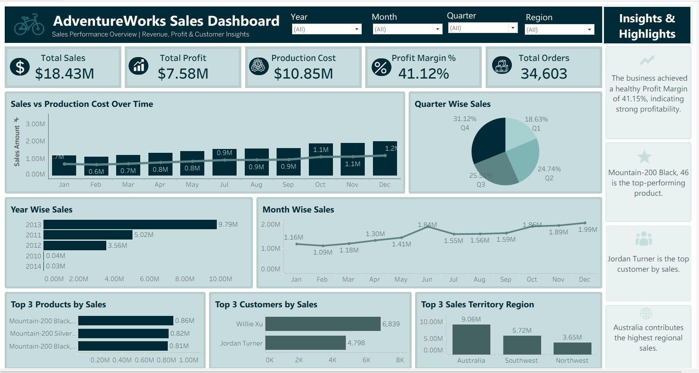

# 📊 AdventureWorks Sales Dashboard | Tableau

## Overview

This project presents an interactive Tableau dashboard built using the AdventureWorks dataset.

The dashboard helps analyze sales performance, customer behavior, product performance, and business KPIs through interactive visualizations.

## Dashboard Preview

## Tools Used

- Tableau Desktop
- Tableau Public
- Calculated Fields
- Filters
- Parameters
- KPI Cards
- Interactive Dashboards

## Dashboard Features

- Sales Analysis
- Customer Insights
- Product Performance Analysis
- KPI Monitoring
- Interactive Filters
- Dynamic Visualizations

## Project Structure

Dashboard/
  AdventureWorks_Sales_Tableau_Dashboard.twbx

Images/
  tableau-dashboard-preview.png

## Author

Deeksha Poojary

Aspiring Data Analyst

LinkedIn:
https://www.linkedin.com/in/deeksha-poojary-584423230/

GitHub:
https://github.com/Deekshapoojary
